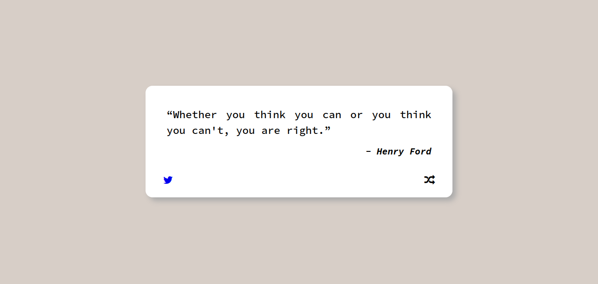
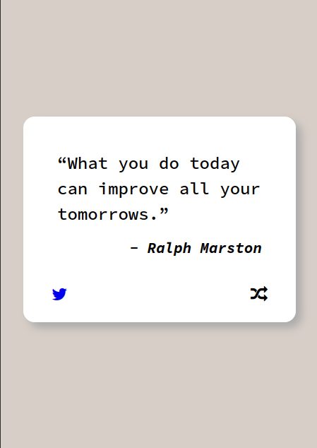

# Random Quote Machine

 

A simple random quote generator created with Reactjs and [Quotable](https://github.com/lukePeavey/quotable) API

Live Demo: https://m-dennisgocong.github.io/random-quote-machine/

## Features

* On first load display a random quote with the author's name
* Easily share the current quote to Twitter with your friends  
* Request new a random quote

## Tech Stack

* Reactjs
* CSS Vanilla
* Nodejs
* Vite
* [Quotable](https://github.com/lukePeavey/quotable) is a free, open source quotations API

## General Info

This is one of my project for [Front End Development Libraries](https://www.freecodecamp.org/learn/front-end-development-libraries/front-end-development-libraries-projects/) on freeCodeCamp course. The purpose of this challenge is to apply what we learn, to test out and showcase front end skills.

## Screenshots

## Problems Encountered 

For this project, I mainly use React library using React Hooks however the React course on freeCodeCamp mainly focus on using Class Components which it's not within course scope so basically I have to do my own thing, learning from documentation and watching a lot of youtube tutorial. 
 
## Run Locally

After you clone this repo to your desktop, go to its root directory and run `npm install` to install its dependencies.

Once the dependencies are installed, you can run  `npm run dev` to start the application. You will then be able to access it at localhost

## License
>You can check out the full license [here](https://github.com/IgorAntun/node-chat/blob/master/LICENSE)

This project is licensed under the terms of the **MIT** license.
